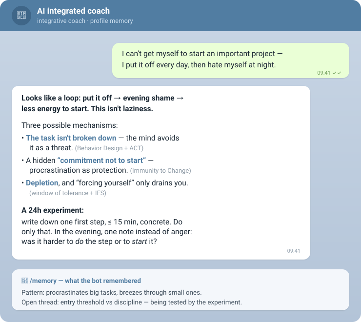

# AICOACH

[Русский](README.md) · **English**

[](CONTRIBUTING.md) [](https://t.me/ai_coach_integrated_bot)

**A private, self-hosted, model-agnostic personal AI coach that actually remembers you.**

Daily reflections on states, decisions, inner conflicts, and recurring patterns — grounded in
established psychotherapy and coaching methods. Your profile grows between sessions and lives in
human-readable `.md` files that you own. Voice or text, from Telegram.

## ▶️ Try it in 30 seconds



**[→ @ai_coach_integrated_bot](https://t.me/ai_coach_integrated_bot)** — a live demo bot on Telegram.
Tell it what's on your mind, and get a structured reflection back. `/start` — what it is and how it
works, `/memory` — what the bot has understood about you, `/export` — take your memory with you,
`/delete_my_data` — wipe everything.

> The demo is a shared public instance: each chat gets its own isolated, anonymized profile, memory
> is encrypted at rest, and there's a 30-message daily cap. But it is **not** zero-knowledge (the
> key sits with the operator) — **don't send passwords or anything you wouldn't show a third party**.
> For real privacy, [run your own instance](#quick-start) — your data never leaves your server.

> ⚠️ **Disclaimer.** AICOACH is a tool for self-reflection, **not a medical device and not a
> replacement for a therapist, doctor, or emergency help**. It does not diagnose. If you notice
> signs of crisis, risk to life, violence, or mental illness, reach out to a real professional or
> emergency services. By using the project, you accept this risk yourself.

---

## What makes it different

The market is split between closed single-school apps (usually CBT) that keep your data with the
vendor, and open-source GPT wrappers with no long-term memory. AICOACH brings together what neither
has:

- **Integrative approach** — 12 schools (IFS, ACT, CBT, schema therapy, attachment theory,
  Motivational Interviewing, Immunity to Change, AQAL, Systems Thinking, Behavior Design, emotion
  regulation, experiential learning). The model picks 1–3 lenses per request.
- **Transparent profile memory** — plain `.md` files on your side. No vendor-side vector database:
  you can open them, read them, and **edit your profile by hand**.
- **Model-agnostic** — any OpenAI-compatible endpoint: Claude/DeepSeek/Qwen/Llama via OpenRouter,
  your own LiteLLM, or a local Ollama. Which one to pick — see the
  [model comparison](docs/model-comparison.md) (quality/cost/latency on a real case).
- **Self-host, privacy** — your data never leaves your server (except the call to your chosen model).
- **Voice** — dictation is transcribed (Groq Whisper or locally).

Philosophy: the goal isn't to maximize productivity, but to **widen your freedom of choice** — more
clarity, less inner war, one honest next step.

## Who it's for

- **People who want to understand themselves** — regular self-reflection, without booking a
  specialist and without handing your life to someone else's cloud.
- **Working coaches** — encode your own method as a skill and drop it into the repo: the bot runs
  the conversation on your frame, not a generic one.

## Why not just ChatGPT / Claude?

A smarter model isn't the point: you can run the very same Claude or GPT as the brain of AICOACH.
What matters is the **harness around the model**. A raw chat hands you a brilliant stranger every
time — AICOACH gives you a method and a memory.

> 📊 **Which model to pick** for quality vs cost — [a live A/B on a real case](docs/model-comparison.md):
> glm-5.2 reaches GPT-level at roughly 10× less.

| Raw ChatGPT / Claude | AICOACH |
|---|---|
| Vendor memory: shallow, cloud-bound, opaque | Your profile is `.md` files: read them, edit by hand, export, delete |
| Defaults to agreeing and "rescuing" | A coaching method: 12 schools, non-rescuing, holds both/and, gives a next step |
| A long thread dilutes context, accuracy drifts | Memory is externalized to files + targeted `recall` + skills loaded on demand — the working context stays focused |
| A conversation transcript | A curator distills patterns/decisions/open threads across sessions |
| Your confessions sit in a vendor's cloud on their terms | Self-host: data on your server; a local model — nothing leaves at all |
| Your chats can be used to train the model | Open-weight models (especially local): your reflections don't feed a vendor's training set |
| Locked to one vendor and its price | Model-agnostic: pick quality/cost ([GPT-level ~10× cheaper](docs/model-comparison.md)) |
| One more browser tab | Voice + Telegram — where you already are |

A paid chat is a general-purpose tool. AICOACH is a purpose-built loop for regular work on
yourself — a memory you own and a frame that doesn't just nod along.

## Architecture

A "bare brain" with a skill and tools to its own memory: the model decides for itself when to
recall and when to write:

```
[voice/text from Telegram] → (STT) →
   ┌─ Brain (single LLM, tool-loop) ────────────────┐
   │  system prompt = coaching skill                 │
   │  tools:                                          │
   │    recall(query)        — search memory          │
   │    save_memory(...)     — write + curator        │
   │    load_skill(title)    — load a lens            │
   └──────────────────────────────────────────────────┘
                    │
   memory = .md files in tenants/<id>/ (path isolation)
```

- `service.py` — FastAPI, `/session` endpoint (SSE stream).
- `memory.py` — file-based memory, per-tenant directory isolation, curator (`supersedes`, append/replace).
- `tools.py` — memory tool schemas.
- `bot.py` — Telegram (long-polling, voice via Groq STT, incoming debounce).
- `skills/` — coaching skills (modular `SKILL.md`).

## Quick start

```bash
# 1. bot on Telegram: @BotFather → /newbot → token
# 2. environment
cp deploy/env.example .env      # fill in LLM_*, TG_BOT_TOKEN, (optional) GROQ_API_KEY
python3 -m venv .venv && .venv/bin/pip install -r requirements.txt
# 3. run
set -a; . ./.env; set +a
.venv/bin/python -m uvicorn service:app --port 8091 &   # brain
.venv/bin/python bot.py                                  # bot
```

Your first message to the bot returns your `chat_id` — put it in `ALLOWED_CHAT_ID` and restart
(access limited to you). For 24/7 production via systemd, see [deploy/DEPLOY.md](deploy/DEPLOY.md).

## Privacy

- Profile and conversation live in `tenants/` (in `.gitignore`, never leave the machine).
- The only outbound traffic is the request to the model you chose. Want **nothing** to leave the
  machine — plug in a local model (Ollama) in `.env`.
- `chat_id` whitelist: in private mode (the default) the bot answers only the allowed chat.

### Public demo mode (`PUBLIC_MODE=true`)

Opens the bot to everyone on Telegram — see [deploy/env.demo.example](deploy/env.demo.example). What
it gives you — and what it does not:

- **`tenant_id` = salt + hash(chat_id)** — the on-disk profile directory isn't labeled with your
  Telegram ID directly.
- **Memory encryption at rest** (`MEMORY_ENCRYPTION_KEY`, Fernet) — profile files aren't readable
  as plain text on disk.
- **Daily message cap** per chat — protects the operator's budget from abuse.

Honestly: this protects against a **leaked backup/disk** reaching a third party, not against the
**server operator** — they have both the salt and the encryption key sitting next to the data. For a
true "even the operator can't read it," you need a user-passphrase mode (key on the client) — a
separate, not-yet-implemented capability. For real privacy, run your own private instance.

## Status

MVP: voice/text, integrative reflection, growing profile, isolation, 24/7 deploy. Next:
anonymization/at-rest encryption for public deployment, multi-user, optional web access to the
model. See issues.

## Contributing

PRs and issues welcome — entry points, code map, and style in [CONTRIBUTING.md](CONTRIBUTING.md).

## License

MIT — see [LICENSE](LICENSE).
