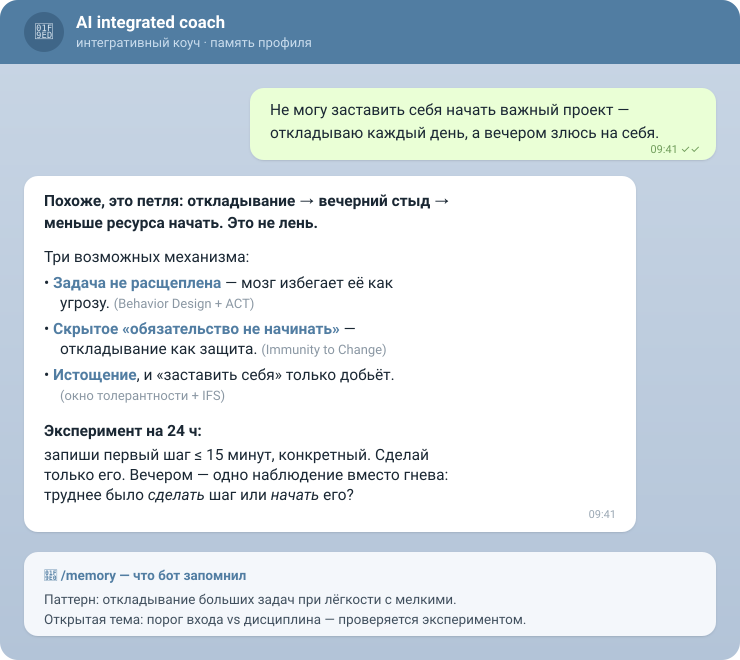

# AICOACH

**Русский** · [English](README.en.md)

[](CONTRIBUTING.md) [](https://t.me/ai_coach_integrated_bot)

**Личный AI-коуч, который тебя помнит — приватный, self-hosted, работает на любой модели.**
_A private, self-hosted, model-agnostic personal AI coach that actually remembers you._

Ежедневные разборы состояний, решений, внутренних конфликтов и повторяющихся паттернов —
по проверенным подходам психотерапии и коучинга. Профиль растёт между сессиями и хранится
у тебя в человекочитаемых `.md`-файлах. Голос или текст, из Telegram.

## ▶️ Попробовать за 30 секунд



**[→ @ai_coach_integrated_bot](https://t.me/ai_coach_integrated_bot)** — живой демо-бот в Telegram.
Напиши, что сейчас занимает или тревожит, либо пришли свой тест, опросник или стенограмму — и
получишь разбор. `/start` — что это и как устроено, `/memory` — что бот о тебе понял, `/export` —
забрать свою память, `/delete_my_data` — стереть всё.

> Демо — публичный общий инстанс: у каждого чата свой изолированный, обезличенный профиль,
> память шифруется at-rest, лимит 30 сообщений в день. Но это **не** zero-knowledge (ключ у
> оператора) — **не присылай пароли и то, что нельзя показывать третьим лицам**. Нужна полная
> приватность — [разверни свой инстанс](#быстрый-старт), данные не покинут твой сервер.

> ⚠️ **Дисклеймер.** AICOACH — инструмент для саморефлексии, **не медицинское изделие и не
> замена психотерапевта, врача или экстренной помощи**. Он не ставит диагнозов. При признаках
> кризиса, риска для жизни, насилия или психического расстройства обратись к живому
> специалисту или в службу экстренной помощи. Используя проект, ты принимаешь этот риск на себя.

---

## Чем отличается

На рынке — либо closed-приложения одной школы (обычно CBT) с данными у вендора, либо
опенсорс-обёртки над GPT без долговременной памяти. AICOACH собирает то, чего нет вместе:

- **Интегративный подход** — 12 школ (IFS, ACT, CBT, схемотерапия, теория привязанности,
  Motivational Interviewing, Immunity to Change, AQAL, Systems Thinking, Behavior Design,
  эмоциональная регуляция, экспериментальное обучение). Модель выбирает 1–3 оптики под запрос.
- **Прозрачная память профиля** — обычные `.md`-файлы у тебя. Никакой векторной БД на стороне
  вендора: можно открыть, прочитать и **поправить профиль руками**.
- **Модель-агностичность** — любой OpenAI-совместимый endpoint: Claude/DeepSeek/Qwen/Llama
  через OpenRouter, свой LiteLLM или локальный Ollama. Какую выбрать — см.
  [сравнение моделей](docs/model-comparison.md) (качество/цена/латентность на реальном кейсе).
- **Self-host, приватность** — данные не покидают твой сервер (кроме вызова выбранной модели).
- **Голос** — надиктовка расшифровывается (Groq Whisper или локально).

Философия: цель не в максимизации продуктивности, а в **расширении свободы выбора** — больше
ясности, меньше внутренней войны, один честный следующий шаг.

## Для кого

- **Тем, кто хочет разобраться в себе** — регулярная саморефлексия без записи к специалисту и без
  выгрузки своей жизни в чужое облако.
- **Практикующим коучам** — закодируй свой метод как skill и вложи в репозиторий: бот поведёт
  разговор по твоей рамке, а не по обобщённой.

## Почему не просто ChatGPT / Claude?

Умнее модель тут ни при чём: мозгом AICOACH можно поставить хоть тот же Claude или GPT. Всё
решает **обвязка вокруг модели**. Голый чат каждый раз даёт тебе гениального незнакомца — AICOACH
даёт метод и память.

> 📊 **Какую модель взять** под качество/цену — [живой A/B-разбор на реальном кейсе](docs/model-comparison.md):
> glm-5.2 выдаёт GPT-уровень примерно за 10× меньше.

| Голый ChatGPT / Claude | AICOACH |
|---|---|
| Память вендорная, поверхностная, в облаке, непрозрачная | Профиль — твои `.md`-файлы: читаешь, правишь руками, экспортируешь, удаляешь |
| По умолчанию соглашается и «спасает» | Коучинговый метод: 12 школ, non-rescuing, держит «и/и», даёт следующий шаг |
| Длинный тред размывает контекст, точность плывёт | Память вынесена в файлы + точечный `recall` + скиллы грузятся под запрос — рабочий контекст остаётся сфокусированным |
| Транскрипт разговора | Curator дистиллирует паттерны/решения/открытые темы между сессиями |
| Твои откровения — в облаке вендора под его правилами | Self-host: данные на твоём сервере; локальная модель — не уходят вообще |
| Чаты могут пойти в обучение модели | Open-weight модели (особенно локально): твои откровения не кормят обучающую выборку вендора |
| Заперт на одном вендоре и его цене | Модель-агностик: качество/цена по выбору ([GPT-уровень ~10× дешевле](docs/model-comparison.md)) |
| Ещё один таб в браузере | Голос + Telegram — там, где ты уже есть |

Платный чат — универсальный инструмент. AICOACH — специализированный контур для регулярной
работы над собой: память, которой ты владеешь, и рамка, которая не поддакивает.

## Архитектура

«Голый мозг» со скиллом и инструментами к своей памяти: модель сама решает, когда вспомнить и
когда записать:

```
[голос/текст из Telegram] → (STT) →
   ┌─ Мозг (один LLM, tool-loop) ──────────────────┐
   │  system prompt = коучинговый скилл             │
   │  инструменты:                                  │
   │    recall(query)        — поиск по памяти       │
   │    save_memory(...)     — запись + curator      │
   │    load_skill(title)    — подгрузить оптику      │
   └────────────────────────────────────────────────┘
                    │
   память = .md-файлы в tenants/<id>/ (изоляция по пути)
```

- `service.py` — FastAPI, endpoint `/session` (SSE-стрим).
- `memory.py` — файловая память, изоляция по каталогу tenant, curator (`supersedes`, append/replace).
- `tools.py` — схемы инструментов памяти.
- `bot.py` — Telegram (long-polling, голос через Groq STT, дебаунс входящих).
- `skills/` — коучинговые скиллы (модульные `SKILL.md`).

## Быстрый старт

```bash
# 1. бот в Telegram: @BotFather → /newbot → токен
# 2. окружение
cp deploy/env.example .env      # заполнить LLM_*, TG_BOT_TOKEN, (опц.) GROQ_API_KEY
python3 -m venv .venv && .venv/bin/pip install -r requirements.txt
# 3. запуск
set -a; . ./.env; set +a
.venv/bin/python -m uvicorn service:app --port 8091 &   # мозг
.venv/bin/python bot.py                                  # бот
```

Первое сообщение боту вернёт твой `chat_id` — впиши его в `ALLOWED_CHAT_ID` и перезапусти
(доступ только тебе). Прод 24/7 — через systemd, см. [deploy/DEPLOY.md](deploy/DEPLOY.md).

## Приватность

- Профиль и переписка — в `tenants/` (в `.gitignore`, наружу не уходят).
- `chat_id` каждого, кто нажимает `/start`, хранится отдельно в `contacts.enc`: это нужно, чтобы
  бот мог оставаться на связи и помнить знакомство. При `MEMORY_ENCRYPTION_KEY` файл шифруется;
  `/delete_my_data` удаляет `chat_id` вместе с памятью.
- `/delete_my_data` чистит и слой качества (`supervision.db`): текст разговоров и разбор критика
  стираются, тенант обезличивается. Остаётся оценка «в точку / частично / мимо» и трейс хода
  (какие инструменты звал коуч, сколько нашёл `recall`) — без текста и без привязки к человеку.
  Это продуктовый опыт, а не факт о человеке, и единственный сигнал о том, где коуч ошибается.
- Наружу идёт только запрос к выбранной тобой модели. Хочешь, чтобы **ничего** не покидало
  машину, — подключи локальную модель (Ollama) в `.env`.
- `chat_id`-whitelist: в приватном режиме (по умолчанию) бот отвечает только разрешённому чату.

### Публичный демо-режим (`PUBLIC_MODE=true`)

Открывает бота всем в Telegram — см. [deploy/env.demo.example](deploy/env.demo.example). Что это
даёт — и чего не даёт:

- **`tenant_id` = соль + hash(chat_id)** — на диске каталог с профилем не подписан твоим
  Telegram ID напрямую.
- **Шифрование памяти at-rest** (`MEMORY_ENCRYPTION_KEY`, Fernet) — файлы профиля на диске
  нечитаемы как текст.
- **Дневной лимит сообщений** на чат — защищает бюджет оператора от злоупотребления.

Честно: это защищает от **утечки бэкапа/диска** третьей стороне, а не от **оператора сервера** —
у него и соль, и ключ шифрования лежат рядом с данными. Для действительно «даже оператор не
прочитает» нужен режим на пароле пользователя (свой ключ на клиенте) — это отдельная, ещё не
реализованная возможность. Для настоящей приватности — разверни свой приватный инстанс.

## Статус

MVP: голос/текст, интегративный разбор, растущий профиль, изоляция, деплой 24/7.
Дальше: обезличивание/шифрование памяти at-rest для публичного развёртывания, мультиюзер,
опциональный веб-доступ модели. См. issues.

## Вклад

PR и issues приветствуются — точки входа, карта кода и стиль в [CONTRIBUTING.md](CONTRIBUTING.md).

## Лицензия

MIT — см. [LICENSE](LICENSE).
